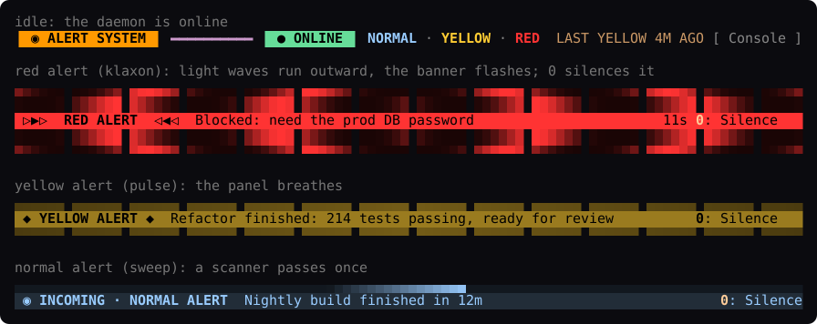

# red-alert

**Audible alerts for Claude Code.** Claude decides when its work deserves your
attention and sounds an alert through your server's speakers: a chirp for a
milestone, a yellow alert when a big task is done, a red alert klaxon when
it's blocked and needs you. A Claude Code mod shows whether the alert system is
online and animates every alert in the terminal.



- **Claude chooses the level.** The mod gives Claude an `alert` tool whose
  levels and their "when to use" descriptions come from your config, so
  Claude picks among the levels you define.
- **Any number of levels, any sounds.** Define levels in one TOML file: name,
  sound (URL or file), how long it sounds (cut or looped to fit), priority,
  color, animation, volume and more.
- **Runs in the background.** A small Python daemon (standard library only)
  runs as a systemd user service and starts at boot.
- **LCARS UI in Claude Code.** An online/offline status band above the
  prompt, animated alert banners (klaxon, pulse, sweep) that run for as long
  as the alert sounds, a key to silence them (`0`), and a console pane and
  `/alert` command for sounding alerts by hand.

```
┌───────────────────────── your server ─────────────────────────┐
│                                                               │
│  Claude Code ── red-alert mod ──HTTP──▶ red-alert daemon ──▶ 🔊│
│   (terminal)     · alert tool           127.0.0.1:1701        │
│                  · status band          · levels from TOML    │
│                  · /alert console       · systemd user unit   │
│                                         · desktop notification│
│  red-alert CLI / curl / scripts ──HTTP──▶                     │
└───────────────────────────────────────────────────────────────┘
```

## Default alert levels

| Level | Sound | Sounds for | Claude uses it when… |
| --- | --- | --- | --- |
| `normal` | [TNG communicator chirp](https://www.trekcore.com/audio/communicator/tng_chirp_clean.mp3) | once (0.5 s) | a small milestone or FYI: a long build or test run finished, a progress checkpoint |
| `yellow` | [computer alert](https://www.trekcore.com/audio/computer/alert09.mp3) | once (2.3 s) | a significant body of work is complete and ready for review |
| `red` | [TNG red alert klaxon](https://www.trekcore.com/audio/redalertandklaxons/tng_red_alert1.mp3) | 12 s (of 21 s) | it is blocked, needs a decision, credentials or approval, or something failed badly |

## Requirements

- Linux with systemd and a sound server: PipeWire (`pw-play`) or PulseAudio
  (`paplay`); `ffplay`, `mpv` and `mpg123` also work.
- Python 3.11 or newer (the system Python on Ubuntu 24.04 and Debian 12 is fine).
- Claude Code with mod support (function-hook plugins).

## Install

```bash
git clone https://github.com/dukechain2333/red-alert.git
cd red-alert
./install.sh
red-alert test          # plays every level in turn
```

`install.sh` installs, for your user only:

| What | Where |
| --- | --- |
| daemon and CLI | `~/.local/share/red-alert/`, `~/.local/bin/red-alert` |
| config (kept if it exists) | `~/.config/red-alert/config.toml` |
| systemd user service, started now and at boot | `~/.config/systemd/user/red-alert.service` |
| Claude Code mod | `~/.claude/skills/red-alert/` (loads as `red-alert@skills-dir`) |

The service starts at boot because the installer enables lingering
(`loginctl enable-linger`), which starts your user's services without a
login. Sounds are downloaded once, on first start, to `~/.cache/red-alert/`.

Options: `--no-service` (files only), `--no-mod` (no Claude Code mod),
`--link-mod` (symlink the mod to the checkout while you develop it).

### Install the mod from GitHub instead

The repository is also a plugin marketplace:

```bash
claude plugin marketplace add dukechain2333/red-alert
claude plugin install red-alert@red-alert
```

You still need the daemon: `./install.sh --no-mod`.

## Using it with Claude Code

Start a new Claude Code session after installing. Then:

- **Claude raises alerts by itself.** The mod adds the
  `mcp__red-alert__alert` tool and a short system-prompt note: Claude calls
  it once, as the last step of a turn that did substantial work, or right
  before it stops to ask you something. It skips quick back-and-forth while
  you are at the keyboard. To change how often it alerts, tell it ("only red
  alerts today", "no alerts for this task") or edit the level descriptions.
  The tool never asks for permission, since all it does is play a sound on
  your own machine.
- **The band above the prompt** shows the alert system's state and your
  levels: `● ONLINE  ● NORMAL  ● YELLOW  ● RED`, plus the last alert. It is
  also a menu: press `ctrl+x tab` to step into the band (the cursor lands on
  `ONLINE`), walk it with `←`/`→`, and press `Enter`:
  - on **ONLINE**: mute every session (it turns into `◐ MUTED`); Enter on
    `MUTED` unmutes. On `○ OFFLINE` it starts the daemon;
  - on a **level**: sound that alert by hand, for the level's duration;
  - on **Console**: open the alert console.

  `Esc` takes you back to the prompt. The levels get no number keys here on
  purpose: a bare digit typed into an empty prompt presses the band's
  buttons, so you couldn't start a message with "1." without sounding an
  alert. (`ctrl+x tab` is Claude Code's `abovePrompt:focus` action; rebind it
  in `~/.claude/keybindings.json` if you like.)

  When an alert sounds, the band turns into an animated banner that runs for
  as long as the sound plays, with a countdown when the level has a
  `duration`:
  - **klaxon** (red): two rows of light bars above and below, with waves
    running outward from the center, and a banner that flashes with marching
    chevrons;
  - **pulse** (yellow): one bar above and below, and the panel breathes;
  - **sweep** (normal): a scanner line runs across.

  Alerts raised elsewhere (another session, the CLI, a script) animate too,
  with their source shown, so every open session sees them.
- **Press `0` to silence an alert.** While a banner is up, typing `0` into
  the empty prompt stops the sound and takes the banner down; you don't need
  to focus anything first. (A bare digit at an empty prompt goes to the
  band's buttons, as with Claude Code's own surveys; `0` in a message you are
  typing is just a `0`.) After the sound ends, a red or yellow banner from
  this session stays lit until you press `0` (now **Dismiss**). Typing your
  next prompt also clears an alert that Claude raised, and silences it if
  it's still sounding.
- **Sound an alert by hand** with `/alert <level> [duration] [message]`:
  `/alert red 30s Meeting in 5 minutes` sounds the red alert for 30 seconds
  (`2m` works too), `/alert yellow` sounds yellow for its configured time.
  `/alert` runs even while Claude is working.
- **The alert console** (`/alert` with no arguments, or **Console** in the
  band) has the system status, a **Manual alert** form and the alert log.
  Type an optional message, press Enter, then the level's number (`1`–`9`)
  to sound it. Other keys: `0` silence, `m` mute 30 min, `u` unmute,
  `r` refresh, `x` close.
- **Other `/alert` subcommands:** `status`, `stop`, `mute [minutes]` (`0` =
  until unmuted), `unmute`, `start` (starts the systemd service).

```
▐ LCARS 1701 ▌ ━━━━━━━━━━━━━━━━━━━━━━━━━━━━━━━━━━━━━━━━━━━━━━━━━ ▐ ALERT CONDITION ▌

SYSTEM     ● ONLINE  http://127.0.0.1:1701 · v0.2.0 · bridge · up 3h · auto (pw-play)
CONDITION  GREEN · STANDING BY

▐ MANUAL ALERT ▌ ━━━━━━━━━━━━━━━━━━━━━━━━━━━━━━━━━━━━━━━━━━━━━━━━━━━━━━━━━━━━━━━━━━━━━━
Message  Lunch is ready_
1: Sound ▐ NORMAL   ▌ p10  sweep  once  A light ping: a small milestone or an FYI…
2: Sound ▐ YELLOW   ▌ p50  pulse  once  A significant body of work is complete…
3: Sound ▐ RED      ▌ p90  klaxon 12s   The user is needed now: you are blocked…

▐ LOG ▌ ━━━━━━━━━━━━━━━━━━━━━━━━━━━━━━━━━━━━━━━━━━━━━━━━━━━━━━━━━━━━━━━━━━━━━━━━━━━━━━
21:04:11  RED     stopped    Need the prod DB password  · claude-code:shop
20:51:37  YELLOW  played     Checkout refactor done, 214 tests pass  · claude-code:shop
20:12:02  NORMAL  played     Nightly build finished  · cli@bridge

[ Silence ] [ Mute 30m ] [ Unmute ] [ Refresh ] [ Close ]
```

### Mod settings

Set these in `/config` (or `claude plugin configure red-alert`):

| Setting | Default | |
| --- | --- | --- |
| `url` | `http://127.0.0.1:1701` | where the daemon listens |
| `token` | empty | the daemon's `server.token`, if you set one |
| `pollSeconds` | `5` | how often the band checks the daemon and picks up alerts raised elsewhere |
| `permissionPromptLevel` | `off` | sound this level whenever Claude Code waits on a permission prompt, the one wait Claude cannot announce itself (e.g. `red`) |
| `idleBand` | `true` | show the status strip while no alert is up |

## Customizing levels

Edit `~/.config/red-alert/config.toml`, then run `red-alert reload`.
Claude Code picks up the change on its own: the mod rebuilds the alert tool
from the daemon's levels.

```toml
[[levels]]
name = "deploy"                     # what Claude passes as the level
priority = 40                       # higher wins when alerts overlap
sound = "~/sounds/fanfare.ogg"      # https:// URL or a file path
style = "pulse"                     # sweep | pulse | klaxon
color = "#33CC99"
volume = 70                         # 0-100
duration = 8                        # sound for 8 s: cut a longer sound, loop a
                                    # shorter one; 0 plays it once (the default)
cooldown_seconds = 30               # ignore repeats within 30 s
notify = true                       # also show a desktop notification
description = "A deployment or release finished successfully."
```

`duration` is how long the alert sounds, up to 300 seconds. A 21-second
klaxon with `duration = 12` stops after 12 seconds; a 2-second doorbell with
`duration = 6` rings three times. Leave it out (or set `0`) to play the sound
once, in full. An alert raised by hand or through the API can override it.

Claude reads each `description` to decide which level to use, so write it as
advice on **when** to use the level. Overlapping alerts: a higher-priority
alert cuts off a lower one that is still playing, and a lower one is skipped
while a higher one plays. See [`config.example.toml`](config.example.toml)
for every option, including `audio.player` (choose a player or give your
own command line) and `server.token`.

## CLI

```
red-alert send LEVEL [MESSAGE...]   sound an alert (-d SECONDS, --title, --source, --json)
red-alert status                    is the daemon up? what is playing?
red-alert levels                    the configured levels
red-alert history [-n 20]           recent alerts
red-alert test [LEVEL]              play one level, or all of them in turn
red-alert stop [ID]                 silence the alert that is playing
red-alert mute [MINUTES]            mute (default 30; 0 = until unmuted)
red-alert unmute
red-alert reload                    re-read the config
red-alert serve                     run the daemon in the foreground
```

The CLI finds the daemon through the config file, `$RED_ALERT_URL` or `--url`
(and `$RED_ALERT_TOKEN` or `--token`). It exits with 3 when the daemon is
unreachable.

## HTTP API

```bash
curl -s localhost:1701/health
curl -s -X POST localhost:1701/alert -H 'Content-Type: application/json' \
     -d '{"level": "yellow", "message": "Backup finished", "source": "cron"}'
```

Endpoints: `GET /health`, `GET /levels`, `GET /history`, `POST /alert`,
`POST /stop`, `POST /mute`, `POST /unmute`, `POST /reload`. See
[docs/API.md](docs/API.md).

## Without the mod

Any Claude Code session that can run shell commands can use the CLI. Put
this in your `CLAUDE.md`:

```markdown
## Alerts
This machine runs red-alert. When you finish a significant task, or right
before you stop to ask me something, run exactly one of:
- `red-alert send normal "<what finished>"`: small milestone or FYI
- `red-alert send yellow "<summary>"`: a big task is done and ready for review
- `red-alert send red "<what you need>"`: you are blocked and need me now
Skip it for quick back-and-forth while I'm at the keyboard.
```

## Claude Code on another machine

The simplest setup is an SSH tunnel, which keeps the daemon on localhost:

```bash
ssh -N -L 1701:127.0.0.1:1701 you@your-server
```

To expose the daemon on the network instead, set `server.host = "0.0.0.0"`
**and** a `server.token` in the config, restart the service, and set the
mod's `url` and `token` to match.

## Troubleshooting

- **`red-alert status` says offline.** Run `systemctl --user status red-alert`
  and `journalctl --user -u red-alert -e`.
- **No sound, but the status says `played`.** The player reached the sound
  server; check the default output and its volume with `wpctl status` (or
  `pactl info`). Try `pw-play some.wav` yourself.
- **Status `failed`.** `red-alert history` shows the reason. Usually a sound
  could not be downloaded (`red-alert levels` flags uncached sounds) or no
  player could decode it: install `ffmpeg` or set `audio.player`.
- **Silent after a reboot until someone logs in.** Lingering starts the
  service at boot, but some setups only give the sound card to the user
  logged in at the console. Enable automatic login for the desktop, or point
  `audio.player` at a player that writes to ALSA directly.
- **Downloading from trekcore.com fails with 406.** The site rejects some user
  agents; the daemon sends its own (`red-alert/<version>`), which works. If
  it changes, download the files yourself and point `sound` at them.

## Uninstall

```bash
./uninstall.sh            # keeps ~/.config/red-alert
./uninstall.sh --purge    # also removes the config and cached sounds
```

## Development

```bash
python3 -m unittest discover -s tests       # daemon tests (a fake player, no sound)
claude plugin validate plugin               # the mod's manifest and hooks
claude plugin test plugin                   # the mod's tests (mocked daemon and clock)
```

To type-check the mod, run `/plugin-types plugin/.claude/types` in Claude
Code, then `npx -p typescript tsc -p plugin`.

Layout: `red_alert.py` (daemon and CLI), `config.example.toml`,
`systemd/`, `install.sh`, `plugin/` (the Claude Code mod: `hooks/register.tsx`
hooks and UI, `hooks/frames.ts` animation frames, `hooks/api.ts` API types,
`types/index.d.ts` its state contract), `tests/`.

## Credits

The default sounds are fetched from [TrekCore](https://www.trekcore.com/audio/)
when the daemon first starts. They are not part of this repository. Star Trek
and its sounds belong to their respective owners; swap in your own sounds if
you need to. The UI borrows the look of LCARS, the Star Trek computer
interface.

## License

[MIT](LICENSE)
